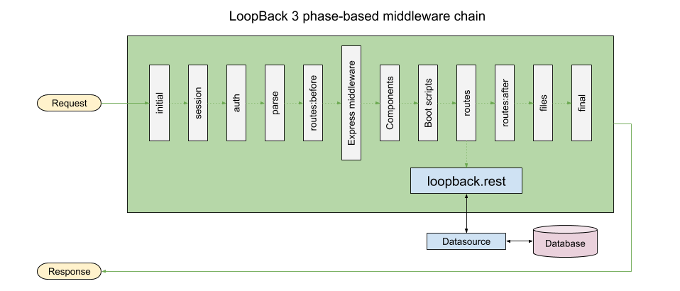
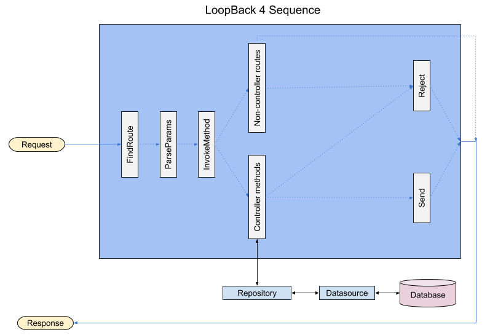

## Differences between LoopBack 3 and LoopBack 4 request/response cycle

The request/response cycle infrastructure and pathway are very different in
LoopBack 3 and LoopBack 4. Knowing the differences will help you migrate
LoopBack 3 apps to LoopBack 4 and implement new request/response related
features in LoopBack 4.

This document will guide you through the differences and show the LoopBack 4
equivalent, if there is any.

### Request/response infrastructure

The difference begins with the LoopBack application object itself. In
LoopBack 3, it is an instance of an Express app; in LoopBack 4, it is not.
Although LoopBack 4 uses Express as the HTTP server, it is not directly exposed
anymore.

Let's take a look at how the means of adding request/response infrastructure
have changed in LoopBack 4.

#### Express middleware and routers

In LoopBack 3 you could add routes and load custom middleware using `app.get()`,
`app.post()`, `app.use()`, etc., just like how you do in Express.
In LoopBack 4, you cannot do it yet. However, you can
[mount a LoopBack 4](https://loopback.io/doc/en/lb4/express-with-lb4-rest-tutorial.html)
on an Express app, which would allow you to still use the familiar routing
methods.



If you want to mount a Express router, you can use the
[RestApplication.mountExpressRouter()](https://loopback.io/doc/en/lb4/apidocs.rest.restapplication.mountexpressrouter.html)
API.

Using [Controllers](https://loopback.io/doc/en/lb4/Controllers.html) is the
recommended way for creating custom (and REST) endpoints on your app. Its
support for
[dependency injection](https://loopback.io/doc/en/lb4/Dependency-injection.html)
and [Interceptors](https://loopback.io/doc/en/lb4/Interceptors.html) makes it a
very powerful extension mechanism.

In LoopBack 4
[middleware.json](https://loopback.io/doc/en/lb3/middleware.json.html)
is not required anymore because of architectural changes.

#### Models

In LoopBack 3, models files automatically create the corresponding REST API
endpoints and the database query machinery (using the configured datasource).
In LoopBack 4, model files are limited only to describing the properties of the
data. You will have to create a corresponding
[Repository](https://loopback.io/doc/en/lb4/Repositories.html)
for database connectivity, and
[controllers](https://loopback.io/doc/en/lb4/Controllers.html)
for creating the REST API endpoint.

The fact that you have to create two more artifacts along with the model to
get a REST endpoint working might seem overly tedious at first. However, the
separation of concerns and decoupling the functionality makes the codebase
cleaner, easier to maintain, and much easier to customize functionality at
various levels. This can be better appreciated as the complexity of your app
grows.

For those who are uncomfortable with the concept of having to creating a
repository and a controller for a model, we have a component
[@loopback/rest-crud
](https://loopback.io/doc/en/lb4/Creating-crud-rest-apis.html)
; with a little bit of configuration, a model file is all you will need to
create the REST endpoints. Once your requirements outgrow what
`@loopback/rest-crud` provides, you can implement your REST endpoints the
idiomatic way.

#### Components

Components are still supported in LoopBack 4, but the concept of component
has completely changed.

In LoopBack 3, a
[component](https://loopback.io/doc/en/lb3/LoopBack-components.html)
is a simple Node.js module which exports a function with the signature
`function(app, options)`. In LoopBack 4, a
[component](https://loopback.io/doc/en/lb4/Creating-components.html)
is a TypeScript class which can add
[servers](https://loopback.io/doc/en/lb4/Server.html),
[observers](https://loopback.io/doc/en/lb4/Life-cycle.html),
[providers](https://loopback.io/doc/en/lb4/Creating-components.html#providers),
and controllers to the app using dependency injection.

LoopBack 3 components adding routes can be migrated to LoopBack 4 by moving the
functionality to the controller of a LoopBack 4 component.

Here is an example of migrating a LoopBack 3 routing component to a LoopBack 4
component's controller.



```js
module.exports = (app, options) => {
  app.get('/hi', (req, res) => {
    res.send('Hi!');
  });
};
```



```ts
import {get} from '@loopback/rest';
import {Component} from '@loopback/core';

export class HiController {
  @get('/hi')
  hello(): string {
    return 'Hi!';
  }
}

export class HiComponent implements Component {
  controllers = [HiController];
}
```



```ts
import { HiComponent} from './components/hi.component';
...
export class Lb4AppApplication extends BootMixin(
  ServiceMixin(RepositoryMixin(RestApplication)),
) {
  constructor(options: ApplicationConfig = {}) {
    ...
    this.component(HiComponent);
    ...
  }
}
```

Because of the architectural changes, `component-config.json` is not required
in LoopBack 4 anymore.

#### Boot scripts

If you used LoopBack 3 boot scripts for adding routes to the app, it
should now be moved to a standalone controller, a component, or implemented
using `app.mountExpressRouter()`.

Here is an example of migrating a route added by a boot script to a controller.



```js
module.exports = function(server) {
  server.get('/hello', (req, res) => {
    res.send('Hello!');
  });
};
```



```ts
import {get} from '@loopback/rest';

export class HelloController {
  @get('/hello')
  hello(): string {
    return 'Hello!';
  }
}
```



#### Remote methods

[Remote methods](https://loopback.io/doc/en/lb3/Remote-methods.html) add custom
endpoints to a model's REST interface.



```js
module.exports = function(Person) {
  Person.greet = function(message, cb) {
    cb(null, 'Greetings: ' + message);
  }

  Person.remoteMethod('greet', {
    accepts: {arg: 'message', type: 'string'},
    returns: {arg: 'message', type: 'string'}
  });
};
```

The above remote method's functionality can be migrated to a controller in
LoopBack 4 in the following manner.



```ts
import {post, requestBody} from '@loopback/rest';

export type Greeting = {
  message: string;
}

const spec = {
  content: {'application/json': {schema: {
    type: 'object',
    properties: {
      message: {
        type: 'string'
      }
    }
  }}}
};

export class PersonController {
  @post('/person/greet', {
    responses: {
      '200': spec,
    },
  })
  greet(@requestBody(spec) greeting: Greeting): string {
    return 'Greetings: ' + greeting.message;
  }
}
```

### Request/response pathway

The request/response architecture has undergone a drastic change in LoopBack 4.
LoopBack 3's
[phase-based middleware routing system](https://loopback.io/doc/en/lb3/Routing.html)
is now replaced by a
[sequence handler](https://loopback.io/doc/en/lb4/apidocs.rest.defaultsequence.html)
that sits infront of a
[routing table](https://loopback.io/doc/en/lb4/apidocs.rest.routingtable.html).

#### LoopBack 3



In LoopBack 3, middleware are added using Express APIs and via phases in
`middleware.json` or using
[app.middleware()](https://apidocs.loopback.io/loopback/#app-middleware).
Request to the app passes through the middleware chain in the following order.

- `initial:before`
- `initial`
- `initial:after`
- `session:before`
- `session`
- `session:after`
- `auth:before`
- `auth`
- `auth:after`
- `parse:before`
- `parse`
- `parse:after`
- `routes:before`
- [Express middleware](http://expressjs.com/guide/writing-middleware.html)
- [Components](https://loopback.io/doc/en/lb3/LoopBack-components.html)
- [Boot scripts](https://loopback.io/doc/en/lb3/Defining-boot-scripts.html)
- `routes`
- `routes:after`
- `files:before`
- `files`
- `files:after`
- `final:before`
- `final`
- `final:after`

Any middleware higher up in the chain may terminate the request by sending a
response back to the client.

REST API middleware is added in the `routes` phase and error handlers in the
`final` and `final:after` phases.

The REST API middleware is responsible for creating REST API endpoints out of
the models in the app. It then uses the configured datasource for connecting
and querying the undelying database for the corresponding REST requests.

##### Access to the request/response object

Since LoopBack 3 uses the Express middleware pattern, the request and response
objects can always be accessed in middleware functions.

##### User-submitted data

- How can users access client submitted data?
- What is responsible for validating the data?
- What is responsible for formatting the data?
- What is responsible for parsing filters?
- Where can users access validated and formatted data?

#### LoopBack 4



- Describe the sequence handler-based architecture in LB4 briefly
- Link to LB4 res-res doc

##### Access to request/response object

- Where are the points where req-res objects can be accessed?
- How do we make req-res objects available to various components of LB4?
- What is the remote methods equivalent in LB4?
- What is the operation hooks in LB4?

##### User-submitted data

- How can users access client submitted data?
- What is responsible for formatting the data?
- What is responsible for validating the data?
- What is responsible for parsing filters?
- Where can users access validated and formatted data?
